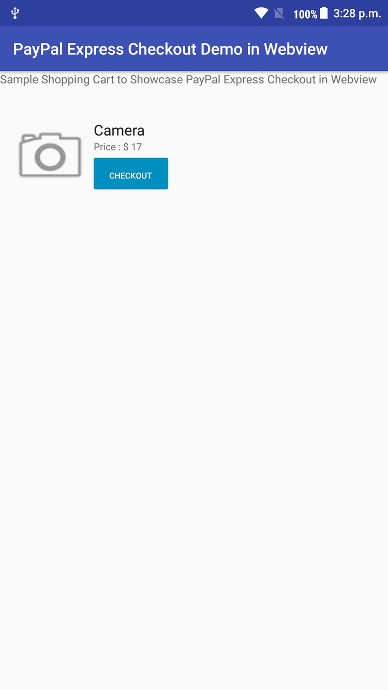

# Android_PayPal_EC_WebView_Demo

Android PayPal Express Checkout Demo using WebView

>Clone the android app repository to your local machine 

>Open the project from Android Studio.

>Connect your device via usb, Run – Run App will deploy the app to your android device.

>Click Blue Checkout button, this will initiate create payments and PayPal Flow will continue 

##### Heroku Server link 

>https://node-paypal-express-sever.herokuapp.com/ (Make Sure the Link is alive when you test your app  )

#### Node Server Source Code (This source code is deployed in Heroku) 

>https://github.com/santhoshlfms/Android_PayPal_EC_NodeJs_Server_Sample.git

##### Screencast

